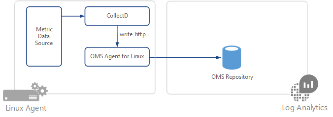

# Collect data from CollectD on Linux agents in Log Analytics
[CollectD](https://collectd.org/) is an open source Linux daemon that periodically collects performance metrics from applications and system level information. Example applications include the Java Virtual Machine (JVM), MySQL Server, and Nginx. This article provides information on collecting performance data from CollectD in Log Analytics.

A full list of available plugins can be found at [Table of Plugins](https://collectd.org/wiki/index.php/Table_of_Plugins).

The following CollectD configuration is included in the Log Analytics agent for Linux to route  CollectD data to the Log Analytics agent for Linux.

[!INCLUDE [log-analytics-agent-note](../../../includes/log-analytics-agent-note.md)]

    LoadPlugin write_http

    <Plugin write_http>
         <Node "oms">
         URL "127.0.0.1:26000/oms.collectd"
         Format "JSON"
         StoreRates true
         </Node>
    </Plugin>

Additionally, if using an versions of collectD before 5.5 use the following configuration instead.

    LoadPlugin write_http

    <Plugin write_http>
       <URL "127.0.0.1:26000/oms.collectd">
        Format "JSON"
         StoreRates true
       </URL>
    </Plugin>

The CollectD configuration uses the default`write_http` plugin to send performance metric data over port 26000 to Log Analytics agent for Linux. 

> [!NOTE]
> This port can be configured to a custom-defined port if needed.

The Log Analytics agent for Linux also listens on port 26000 for CollectD metrics and then converts them to Log Analytics schema metrics. The following is the Log Analytics agent for Linux configuration  `collectd.conf`.

    <source>
      type http
      port 26000
      bind 127.0.0.1
    </source>

    <filter oms.collectd>
      type filter_collectd
    </filter>

## Versions supported
- Log Analytics currently supports CollectD version 4.8 and above.
- Log Analytics agent for Linux v1.1.0-217 or above is required for CollectD metric collection.

## Configuration
The following are basic steps to configure collection of CollectD data in Log Analytics.

1. Configure CollectD to send data to the Log Analytics agent for Linux using the write_http plugin.  
2. Configure the Log Analytics agent for Linux to listen for the CollectD data on the appropriate port.
3. Restart CollectD and Log Analytics agent for Linux.

### Configure CollectD to forward data 

1. To route CollectD data to the Log Analytics agent for Linux, `oms.conf` needs to be added to CollectD's configuration directory. The destination of this file depends on the Linux  distro of your machine.

    If your CollectD config directory is located in /etc/collectd.d/:

        sudo cp /etc/opt/microsoft/omsagent/sysconf/omsagent.d/oms.conf /etc/collectd.d/oms.conf

    If your CollectD config directory is located in /etc/collectd/collectd.conf.d/:

        sudo cp /etc/opt/microsoft/omsagent/sysconf/omsagent.d/oms.conf /etc/collectd/collectd.conf.d/oms.conf

    >[!NOTE]
    >For CollectD versions before 5.5 you will have to modify the tags in `oms.conf` as shown above.
    >

2. Copy collectd.conf to the desired workspace's omsagent configuration directory.

        sudo cp /etc/opt/microsoft/omsagent/sysconf/omsagent.d/collectd.conf /etc/opt/microsoft/omsagent/<workspace id>/conf/omsagent.d/
        sudo chown omsagent:omiusers /etc/opt/microsoft/omsagent/<workspace id>/conf/omsagent.d/collectd.conf

3. Restart CollectD and Log Analytics agent for Linux with the following commands.

    sudo service collectd restart
    sudo /opt/microsoft/omsagent/bin/service_control restart

## CollectD metrics to Log Analytics schema conversion
To maintain a familiar model between infrastructure metrics already collected by Log Analytics agent for Linux and the new metrics collected by CollectD the following schema mapping is used:

| CollectD Metric field | Log Analytics field |
|:--|:--|
| host | Computer |
| plugin | None |
| plugin_instance | Instance Name If **plugin_instance** is *null* then InstanceName="*_Total*" |
| type | ObjectName |
| type_instance | CounterName If **type_instance** is *null* then CounterName=**blank** |
| dsnames[] | CounterName |
| dstypes | None |
| values[] | CounterValue |

## Next steps
* Learn about [log searches](../../azure-monitor/log-query/log-query-overview.md) to analyze the data collected from data sources and solutions. 
* Use [Custom Fields](../../azure-monitor/platform/custom-fields.md) to parse data from syslog records into individual fields.

