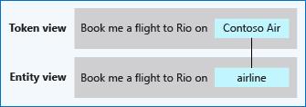
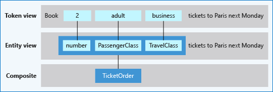
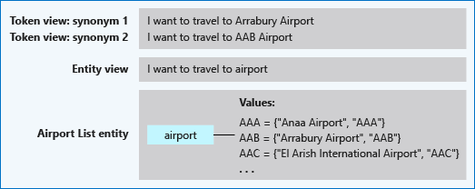
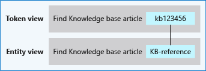

# Plan your LUIS app

It is important to plan your app. Identify your domain, including possible intents and entities that are relevant to your application.  

## Identify your domain
A LUIS app is centered around a domain-specific topic.  For example, you may have a travel app that performs booking of tickets, flights, hotels, and rental cars. Another app may provide content related to exercising, tracking fitness efforts and setting goals. Identifying the domain helps you find words or phrases that are important to your domain.

> [!TIP]
> LUIS offers [prebuilt domains](luis-how-to-use-prebuilt-domains.md) for many common scenarios.
> Check to see if you can use a prebuilt domain as a starting point for your app.

## Identify your intents
Think about the [intents](luis-concept-intent.md) that are important to your application’s task. Let's take the example of a travel app, with functions to book a flight and check the weather at the user's destination. You can define the "BookFlight" and "GetWeather" intents for these actions. In a more complex app with more functions, you have more intents, and you should define them carefully so as to not be too specific. For example, "BookFlight" and "BookHotel" may need to be separate intents, but "BookInternationalFlight" and "BookDomesticFlight" may be too similar.

> [!NOTE]
> It is a best practice to use only as many intents as you need to perform the functions of your app. If you define too many intents, it becomes harder for LUIS to classify utterances correctly. If you define too few, they may be so general as to be overlapping.

## Create example utterances for each intent
Once you have determined the intents, create 10 or 15 example utterances for each intent. To begin with, do not have fewer than this number or create many utterances for each intent. Each utterance should be different from the previous utterance. A good variety in the utterances includes overall word count, word choice, verb tense, and punctuation. 

## Identify your entities
In the example utterances, identify the entities you want extracted. To book a flight, you need some information like the destination, date, airline, ticket category, and travel class. You create entities for these data types and then mark the [entities](luis-concept-entity-types.md) in the example utterances because they are important for accomplishing an intent. 

When you determine which entities to use in your app, keep in mind that there are different types of entities for capturing relationships between types of objects. [Entities in LUIS](luis-concept-entity-types.md) provides more detail about the different types.

### Simple entity
A simple entity describes a single concept.

See [Data Extraction](luis-concept-data-extraction.md#simple-entity-data) to learn more about extracting the simple entity from the endpoint JSON query response. Try this [quickstart](luis-quickstart-primary-and-secondary-data.md) to learn more about how to use a simple entity.

### Hierarchical entity
A hierarchical entity is a special type of a **simple** entity; defining a category and its members in the form of parent-child relationship. The relationship is determined by context from within the utterance. Children of a hierarchical entity are also simple entities.

See [Data Extraction](luis-concept-data-extraction.md#hierarchical-entity-data) to learn more about extracting the hierarchical entity from the endpoint JSON query response. Try this [quickstart](luis-quickstart-intent-and-hier-entity.md) to learn more about how to use a hierarchical entity.

### Composite entity
A composite entity is made up of other entities that form parts of a whole. A composite entity contains a variety of entity types.

See [Data Extraction](luis-concept-data-extraction.md#composite-entity-data) to learn more about extracting the composite entity from the endpoint JSON query response. Try this [tutorial](luis-tutorial-composite-entity.md) to learn more about how to use a composite entity.

### Prebuilt entity
LUIS provides [prebuilt entities](luis-prebuilt-entities.md) for common data types such as number, data, email address, and URL. You can use the number prebuilt entity for the number of tickets in a ticket order.

See [Data Extraction](luis-concept-data-extraction.md#prebuilt-entity-data) to learn more about extracting the Prebuilt entity from the endpoint JSON query response. 

### List entity 
A list entity is an explicitly specified list of values. Each value consists of one or more synonyms. In a travel app, you might choose to create a list entity to represent airport names.

See [Data Extraction](luis-concept-data-extraction.md#list-entity-data) to learn more about extracting list entities from the endpoint JSON query response. Try this [quickstart](luis-quickstart-intent-and-list-entity.md) to learn more about how to use a list entity.

### Regular expression entity
A regular expression entity allows LUIS to extract well-formatted data from an utterance based on a regular expression.

See [Data Extraction](luis-concept-data-extraction.md#regular-expression-entity-data) to learn more about extracting regular expression entities from the endpoint JSON query response. Try the [quickstart](luis-quickstart-intents-regex-entity.md) to learn more about how to use a regular expression entity.

## Next steps
After your app is trained, published, and gets endpoint utterances, plan to implement prediction improvements with [active learning](luis-how-to-review-endoint-utt.md), [phrase lists](luis-concept-feature.md), and [patterns](luis-concept-patterns.md). 

* See [Create your first Language Understanding Intelligent Services (LUIS) app](luis-get-started-create-app.md) for a quick walkthrough of how to create a LUIS app.
