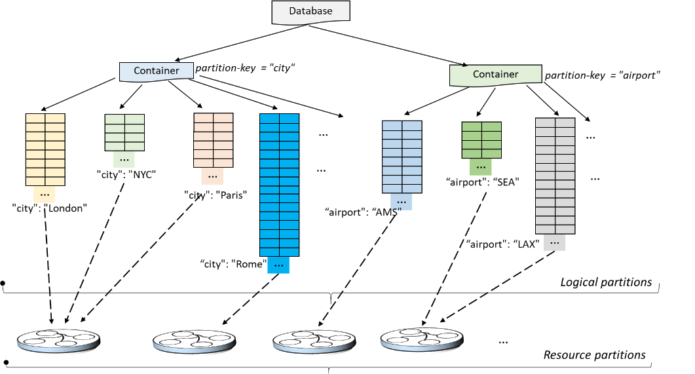
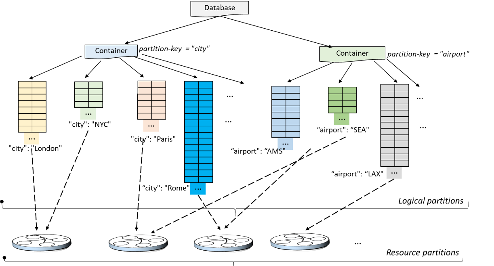

# Provision throughput on Azure Cosmos containers and databases

An Azure Cosmos database is a unit of management for a set of containers. A database consists of a set of schema-agnostic containers. An Azure Cosmos container is the unit of scalability for both throughput and storage. A container is horizontally partitioned across a set of machines within an Azure region and is distributed across all Azure regions associated with your Azure Cosmos account.

Azure Cosmos DB allows you to configure throughput at two granularities - **Azure Cosmos containers** and **Azure Cosmos databases**.

## Setting throughput on a container  

The throughput provisioned on an Azure Cosmos container is exclusively reserved for the container. The container receives the provisioned throughput all the time. The provisioned throughput on a container is financially backed by SLAs. To configure throughput on a container, see [how to provision throughput on a Azure Cosmos container](how-to-provision-container-throughput.md).

Setting provisioned throughput on a container is the widely used option. While you can elastically scale throughput for a container by provisioning any amount of throughput (RUs), you cannot selectively specify the throughput for logical partition(s). When the workload running on a logical partition consumes more than the throughput that was allocated to the specific logical partition, your operations will get rate-limited. When rate-limiting occurs, you can either increase the throughput for the entire container or retry the operation. For more information on partitioning, see [Logical partitions](partition-data.md).

It is recommended that you configure throughput at the container granularity when you want guaranteed performance for the container.

Throughput provisioned on a Azure Cosmos container is uniformly distributed across all the logical partitions of the container. Since one or more logical partitions of a container are hosted by a resource partition, the physical partitions belong exclusively to the container and support the throughput provisioned on the container. The following image shows how a resource partition hosts one or more logical partitions of a container:

## Setting throughput on a database

When you provision throughput on an Azure Cosmos database, the throughput is shared across all the containers in the database, unless you’ve specified a provisioned throughput on specific containers. Sharing the database throughput among its containers is analogous to hosting a database on a cluster of machines. Since all containers within a database share the resources available on a machine, you naturally do not get predictable performance on any specific container. To configure throughput on a database, see [how to configure provisioned throughput on a Azure Cosmos database](how-to-provision-database-throughput.md).

Setting throughput on an Azure Cosmos database guarantees that you receive the provisioned throughput all the time. Since all containers within the database share the provisioned throughput, Azure Cosmos DB does not provide any predictable throughput guarantees for a particular container in that database. The portion of the throughput that a specific container can receive is dependent on:

* The number of containers
* The choice of partition keys for various containers and
* The distribution of the workload across various logical partitions of the containers. 

It is recommended that you configure throughput on a database when you want to share the throughput across multiple containers, but do not want to dedicate the throughput to any particular container. Following are some examples where it is preferred to provision throughput at the database level:

* Sharing a database’s provisioned throughput across a set of containers is useful for a multi-tenant application. Each user can be represented by a distinct Azure Cosmos container.

* Sharing a database’s provisioned throughput across a set of containers is useful when you are migrating a NoSQL database (such as MongoDB, Cassandra) hosted from a cluster of VMs or from on-premises physical servers to Azure Cosmos DB. You can think of the provisioned throughput configured on your Azure Cosmos database as a logical equivalent (but more cost-effective and elastic) to that of the compute capacity of your MongoDB or Cassandra cluster.  

At any given point of time, the throughput allocated to a container within a database is distributed across all the logical partitions of that container. When you have containers sharing provisioned throughput on a database, you can't selectively apply the throughput to a specific container or a logical partition. If the workload on a logical partition consumes more than the throughput that is allocated to a specific logical partition, your operations will be rate-limited. When rate-limiting occurs, you can either increase the throughput for the entire container or retry the operation. For more information on partitioning, see [Logical partitions](partition-data.md).

Multiple logical partitions sharing the throughput provisioned to a database can be hosted on a single resource partition. While a single logical partition of a container is always scoped within a resource partition, 'L' logical partitions across 'C' containers sharing the provisioned throughput of a database can be mapped and hosted on 'R' physical partitions. The following image shows how a resource partition can host one or more logical partitions that belong to different containers within a database:

## Setting throughput on a database and a container

You can combine the two models, provisioning throughput on both database and the container is allowed. The following example shows how to provision throughput on an Azure Cosmos database and a container:

* You can create an Azure Cosmos database named 'Z' with provisioned throughput of 'K' RUs. 
* Next, create five containers named A, B, C, D, and E within the database.
* You can explicitly configure 'P' RUs of provisioned throughput on the container 'B'.
* The 'K' RUs throughput is shared across the four containers – A, C, D, and E. The exact amount of throughput available to A, C, D, or E will vary and there are no SLAs for each individual container’s throughput.
* The Container 'B' is guaranteed to get the 'P' RUs throughput all the time and it is backed by SLAs.

## Comparison of models

|**Quota**  |**Throughput provisioned on a database**  |**Throughput provisioned on a container**|
|---------|---------|---------|
|Minimum RUs |400 (After the first four containers, each additional container requires a minimum of 100 RU/s.) |400|
|Minimum RUs per container|100|400|
|Minimum RUs required to consume 1 GB of storage|40|40|
|Maximum RUs|Unlimited, on the database|Unlimited, on the container|
|RUs assigned/available to a specific container|No guarantees. RUs assigned to a given container depend on the properties such as - choice of partition keys of containers that share the throughput, distribution of workload, number of containers. |All the RUs configured on the container are exclusively reserved for the container.|
|Maximum storage for a container|Unlimited|Unlimited|
|Maximum throughput per logical partition of a container|10K RUs|10K RUs|
|Maximum storage (data + index) per logical partition of a container|10 GB|10 GB|

## Next steps

* Learn more about [logical partitions](partition-data.md)
* Learn [how to provision throughput on a Azure Cosmos container](how-to-provision-container-throughput.md)
* Learn [how to provision throughput on a Azure Cosmos database](how-to-provision-database-throughput.md)

