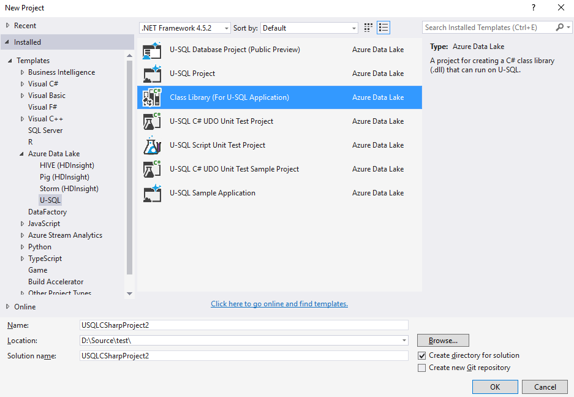
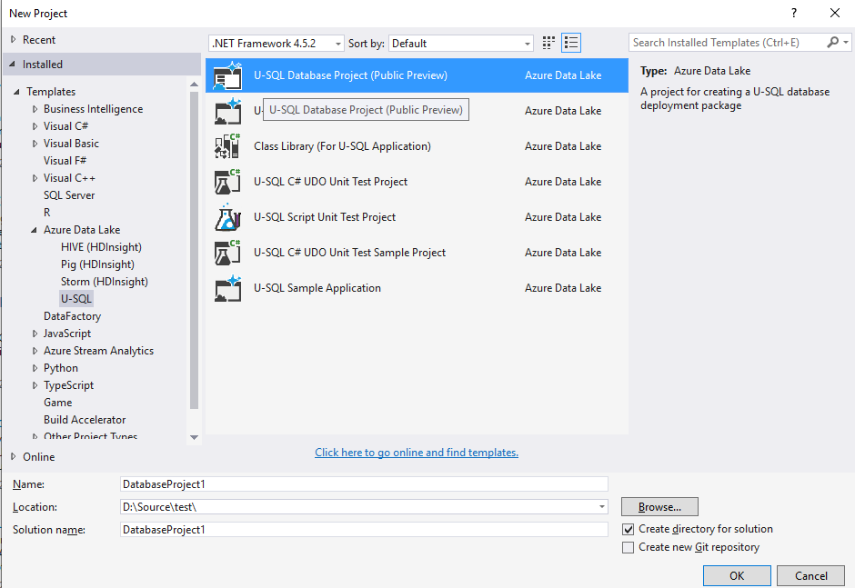
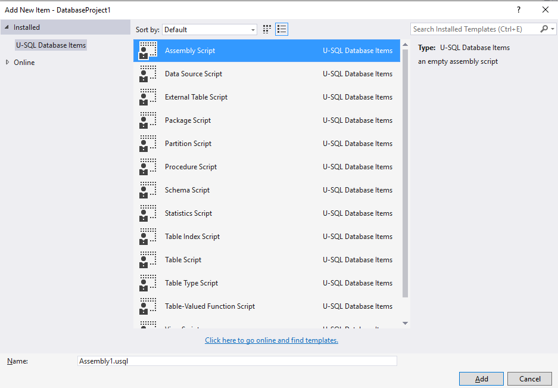
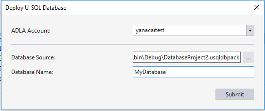

# Best practice of managing U-SQL assemblies in CI/CD pipeline

In this article, you learn how to manage U-SQL assembly source code with the new introduced U-SQL database project. You can also learn how to set up a continuous integration and deployment (CI/CD) pipeline for assembly registration using Azure DevOps.

## Use the U-SQL database project to manage assembly source code

[The U-SQL database project](data-lake-analytics-data-lake-tools-develop-usql-database.md) is a project type in Visual Studio that helps developers develop, manage, and deploy their U-SQL databases quickly and easily. All U-SQL database object (except for credentials) can be managed with the U-SQL database project. 

The recommended way of managing the C# assembly source code and assembly registration DDL U-SQL scripts is to:

* Use **U-SQL Database Project** to manage assembly registration U-SQL scripts.
* Use **Class Library (For U-SQL Application)** to manage the C# source code and dependencies for user-defined operators, functions, and aggregators (UDOs/UDFs/UDAGs).
* Use the U-SQL database project to reference the Class library project. 

A U-SQL Database Project can reference a Class Library (For U-SQL Application) Project. Assemblies registered in the U-SQL database can be created using referenced C# source code from this Class Library (For U-SQL Application) Project.

You can follow below steps of creating projects and adding references:
1. Create a Class Library (For U-SQL Application) project through **File > New > Project**. The project is under **Azure Data Lake > U-SQL** node.
   
2. Add your user-defined C# code in the Class Library (For U-SQL Application) project. 
3. Create a U-SQL project through **File > New > Project**. The project is under **Azure Data Lake > U-SQL** node.
   
4. Add reference to the C# class library project for the U-SQL database project.

     

    
5. Create an assembly script in the U-SQL database project through **right click the project > Add New Item**.
   
6. Open the assembly script, in the assembly design view, choose the referenced assembly from **Create assembly from reference** drop-down menu.

    

7. Add **Managed Dependencies** and **Additional Files** if there are any. When you add additional files, the tool uses the relative path to make sure it can find the assemblies both on your local machine and on the build machine later. 

**@_DeployTempDirectory** in the editor window at the bottom is a predefined variable that points the tool to the build output folder. Under the build output folder, every assembly has a subfolder named with the assembly name. All DLLs and additional files are in that subfolder. 

## Build a U-SQL database project

The build output for a U-SQL database project is a U-SQL database deployment package, named with the suffix `.usqldbpack`. The `.usqldbpack` package is a .zip file that includes all DDL statements in a single U-SQL script in the **DDL** folder, and all built dlls and additional files for assemblies in the **Temp** folder.

## Deploy a U-SQL database

The `.usqldbpack` package can be deployed to either a local account or an Azure Data Lake Analytics account by using Visual Studio or the deployment SDK. 

### Deploy a U-SQL database in Visual Studio

You can deploy a U-SQL database through a U-SQL database project or a `.usqldbpack` package in Visual Studio.

#### Deploy through a U-SQL database project

1.	Right-click the U-SQL database project, and then select **Deploy**.
2.	In the **Deploy U-SQL Database Wizard**, select the **ADLA account** to which you want to deploy the database. Both local accounts and ADLA accounts are supported.
3.	**Database Source** is filled in automatically, and points to the .usqldbpack package in the project's build output folder.
4.	Enter a name in **Database Name** to create a database. If a database with that same name already exists in the target Azure Data Lake Analytics account, all objects that are defined in the database project are created without recreating the database.
5.	To deploy the U-SQL database, select **Submit**. All resources (assemblies and additional files) are uploaded, and a U-SQL job that includes all DDL statements is submitted.

    

    

### Deploy U-SQL database in Azure DevOps

`PackageDeploymentTool.exe` provides the programming and command-line interfaces that help to deploy U-SQL databases. The SDK is included in the [U-SQL SDK Nuget package](https://www.nuget.org/packages/Microsoft.Azure.DataLake.USQL.SDK/), located at `build/runtime/PackageDeploymentTool.exe`.

In Azure DevOps, you can use command line task and this SDK to set up automation pipeline for the U-SQL database refresh. [Learn more about the SDK and how to set up CI/CD pipeline for U-SQL database deployment](data-lake-analytics-cicd-overview.md#deploy-u-sql-database-through-azure-pipelines).

## Next steps

* [How to set up a CI/CD pipeline for Azure Data Lake Analytics](data-lake-analytics-cicd-overview.md)
* [How to test your Azure Data Lake Analytics code](data-lake-analytics-cicd-test.md)
* [Run U-SQL script on your local machine](data-lake-analytics-data-lake-tools-local-run.md)
